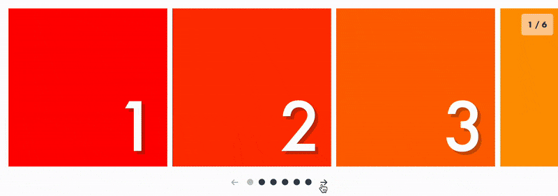

# React Snap Carousel 🫰

[](https://www.npmjs.com/package/react-snap-carousel)
[](https://github.com/richardscarrott/react-snap-carousel/actions/workflows/node.js.yml)
[](https://github.com/richardscarrott/react-snap-carousel/blob/main/LICENSE)

DOM-first, responsive carousel for React.

React Snap Carousel leaves the DOM in charge of scrolling and simply computes derived state from the layout, allowing you to progressively enhance a scroll element with responsive carousel controls.



🧈 Utilizes native browser scrolling & CSS scroll snap points for best performance and UX

📏 Computes responsive page state from DOM layout & scroll position

📲 Dynamic page-based CSS snap point rendering

🎛 Full control over UI using React Hooks API

🖋️ Written in TypeScript

☕️ [Lightweight (~1kB)](https://bundlephobia.com/package/react-snap-carousel) + zero dependencies

## Install

```
npm install react-snap-carousel
```

## Examples

🔥[StoryBook Examples](https://richardscarrott.github.io/react-snap-carousel/)🔥

✨[CodeSandbox StarterKit](https://codesandbox.io/s/react-snap-carousel-49vu6p?file=/src/Carousel.tsx)✨

## Usage

React Snap Carousel doesn't expose a ready-made `<Carousel />` component and instead offers a single export `useSnapCarousel` which provides the state & functions necessary to build your own carousel component.

The following code snippet is a good starting point.

> Inline styles are used for simplicity. You can use whichever CSS framework you prefer.

> You can see it in action on [CodeSandbox](https://codesandbox.io/s/react-snap-carousel-49vu6p?file=/src/Carousel.tsx).

```tsx
// Carousel.tsx
import React, { CSSProperties } from 'react';
import { useSnapCarousel } from 'react-snap-carousel';

const styles = {
  root: {},
  scroll: {
    position: 'relative',
    display: 'flex',
    overflow: 'auto',
    scrollSnapType: 'x mandatory'
  },
  item: {
    width: '250px',
    height: '250px',
    flexShrink: 0
  },
  itemSnapPoint: {
    scrollSnapAlign: 'start'
  },
  controls: {
    display: 'flex',
    justifyContent: 'center',
    alignItems: 'center'
  },
  nextPrevButton: {},
  nextPrevButtonDisabled: { opacity: 0.3 },
  pagination: {
    display: 'flex'
  },
  paginationButton: {
    margin: '10px'
  },
  paginationButtonActive: { opacity: 0.3 },
  pageIndicator: {
    display: 'flex',
    justifyContent: 'center'
  }
} satisfies Record<string, CSSProperties>;

interface CarouselProps<T> {
  readonly items: T[];
  readonly renderItem: (
    props: CarouselRenderItemProps<T>
  ) => React.ReactElement<CarouselItemProps>;
}

interface CarouselRenderItemProps<T> {
  readonly item: T;
  readonly isSnapPoint: boolean;
}

export const Carousel = <T extends any>({
  items,
  renderItem
}: CarouselProps<T>) => {
  const {
    scrollRef,
    pages,
    activePageIndex,
    prev,
    next,
    goTo,
    snapPointIndexes
  } = useSnapCarousel();
  return (
    <div style={styles.root}>
      <ul style={styles.scroll} ref={scrollRef}>
        {items.map((item, i) =>
          renderItem({
            item,
            isSnapPoint: snapPointIndexes.has(i)
          })
        )}
      </ul>
      <div style={styles.controls} aria-hidden>
        <button
          style={{
            ...styles.nextPrevButton,
            ...(activePageIndex === 0 ? styles.nextPrevButtonDisabled : {})
          }}
          onClick={() => prev()}
        >
          Prev
        </button>
        {pages.map((_, i) => (
          <button
            style={{
              ...styles.paginationButton,
              ...(activePageIndex === i ? styles.paginationButtonActive : {})
            }}
            onClick={() => goTo(i)}
          >
            {i + 1}
          </button>
        ))}
        <button
          style={{
            ...styles.nextPrevButton,
            ...(activePageIndex === pages.length - 1
              ? styles.nextPrevButtonDisabled
              : {})
          }}
          onClick={() => next()}
        >
          Next
        </button>
      </div>
      <div style={styles.pageIndicator}>
        {activePageIndex + 1} / {pages.length}
      </div>
    </div>
  );
};

interface CarouselItemProps {
  readonly isSnapPoint: boolean;
  readonly children?: React.ReactNode;
}

export const CarouselItem = ({ isSnapPoint, children }: CarouselItemProps) => (
  <li
    style={{
      ...styles.item,
      ...(isSnapPoint ? styles.itemSnapPoint : {})
    }}
  >
    {children}
  </li>
);
```

```tsx
// App.tsx
import { Carousel, CarouselItem } from './Carousel';

const items = Array.from({ length: 20 }).map((_, i) => ({
  id: i,
  src: `https://picsum.photos/500?idx=${i}`
}));

const App = () => (
  <Carousel
    items={items}
    renderItem={({ item, isSnapPoint }) => (
      <CarouselItem isSnapPoint={isSnapPoint}>
        
      </CarouselItem>
    )}
  />
);

export default App;
```

## License

[MIT](LICENSE)
